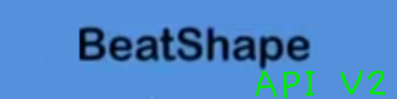

# NOTE: This API Will Get Outphased By The Beatshape Constant One-File API (3.0.0), Beatshape 0.0.9 Will Be The Last Version That Supports the Multi-File API (Current API).
## WARNING: This api has to be online 24/7 due to node.js not storing files correctly. please be aware of this.
# Welcome To The Second Revision Of The Beatshape API!
### First, Make Sure You Have Every Package Installed: `npm i`
- To Launch The Server, Use ``npm start``
- For development / hot reloading, use ``npm dev``

## Private Servers, From One Of Beatshape's Devs.
Listen, I Strongly Approve User Customizability, And So Do I For Private Servers.

So Lets just cut Into The Cake

## For Windows:
- Go To C:\Windows\System32\Drivers\ect\hosts
- Add The Following Entry:
- ``api.beyyt.live      (YOUR SERVER IP/URL)``
- Save And Then Launch Beatshape
- Enjoy Your Private Servers
